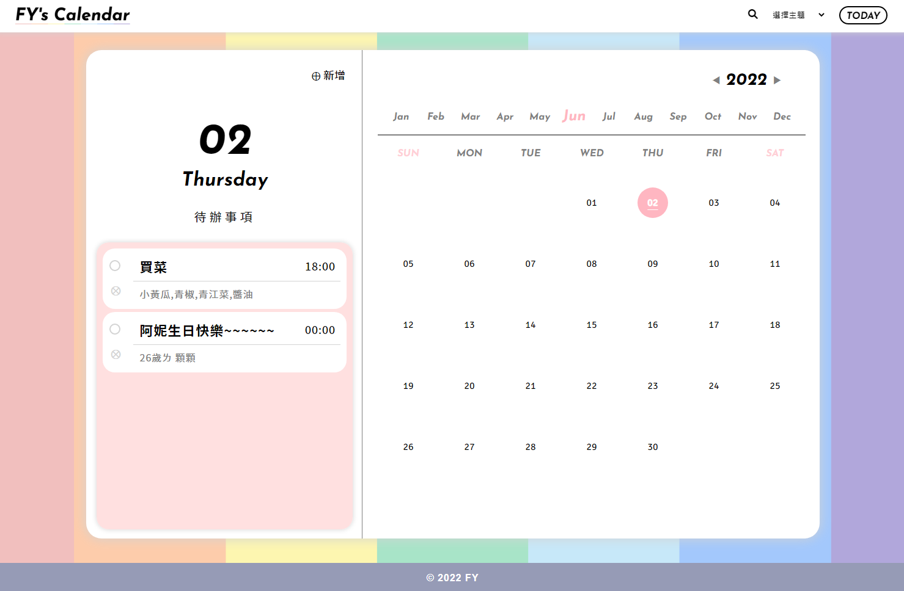
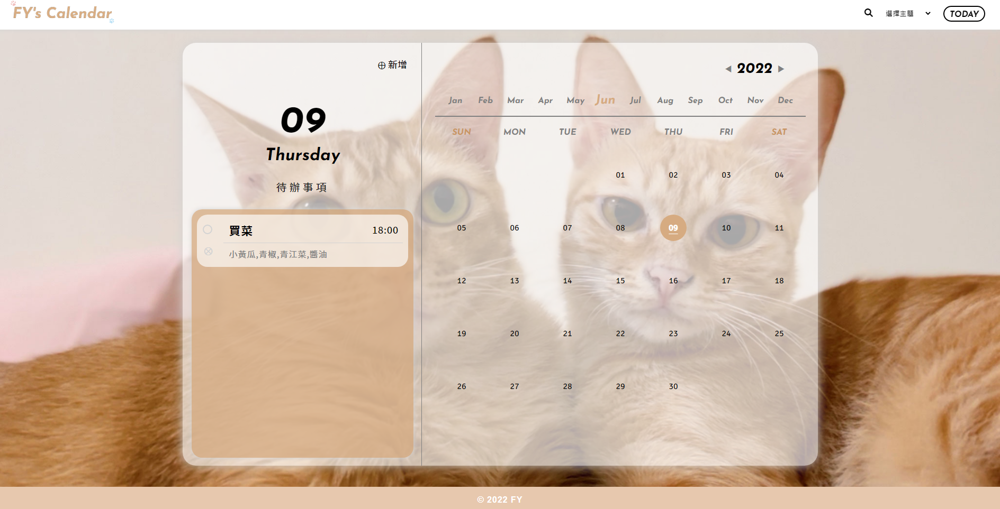
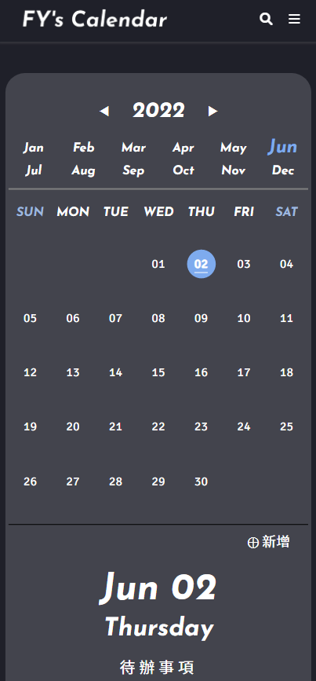

# Perpetual-calendar
## 萬年曆作業
1. 請以PHP程式撰寫一個萬年曆系統
2. 提供連結可以切換不同的月份
3. 加入一些CSS來美化畫面

## 參考作品
* [109年度第一期](http://220.128.133.15/mackliu/10901)
* [109年度第二期](http://220.128.133.15/mackliu/10902)
* [110年度第一期](http://220.128.133.15/mackliu/11001)
* [110年度第二期](http://220.128.133.15/mackliu/11002)

畫面呈現
---

